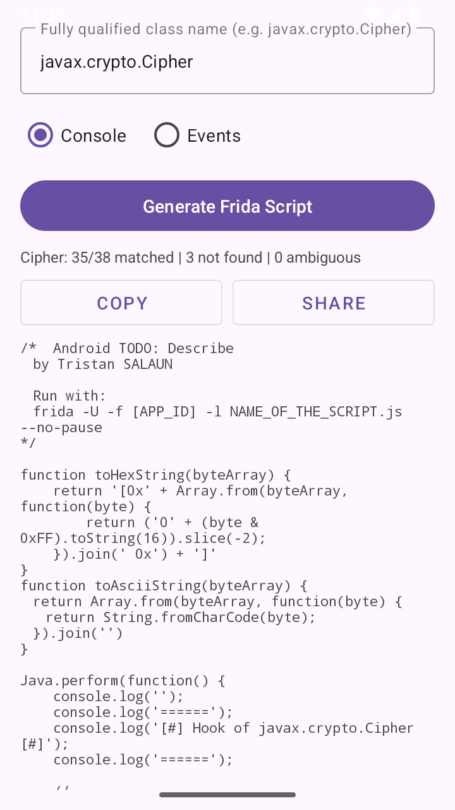

# ReflexionForFrida

An Android application that **automatically generates [Frida](https://frida.re/) hook scripts** by using Kotlin reflection on Android API classes.

Instead of manually writing Frida hooks for every constructor and method of a class, this app inspects the target class at runtime via reflection and produces a ready-to-use JavaScript hook script.

## Screenshot
How it looks like.


## How It Works

1. **Kotlin Reflection** — The app uses `kotlin-reflect` to enumerate all constructors and public methods of the target class, including parameter types and return types.
2. **Documentation Enrichment** — It fetches the official Android documentation from `developer.android.com` to retrieve human-readable parameter names (reflection alone only exposes `arg0`, `arg1`, etc.).
3. **Type Mapping** — Kotlin types are converted to their JVM equivalents so Frida's `overload()` selectors work correctly (e.g. `kotlin.ByteArray` → `[B`, `kotlin.Int` → `int`).
4. **Script Generation** — A [FreeMarker](https://freemarker.apache.org/) template engine produces the final JavaScript file with proper `Java.use()`, `overload()`, and `implementation` blocks.

## Usage

### 1. Generate the Script

1. Install and launch the app on an Android device or emulator.
2. Enter the **fully qualified class name** you want to hook (e.g. `javax.crypto.Cipher`, `java.security.MessageDigest`, `javax.crypto.KeyGenerator`).
3. Select the output template:
   - **Console** — Logs all calls and return values to the Frida console via `console.log()`.
   - **Events** — Sends structured JSON events via `send()`, useful for programmatic processing.
4. Tap **Generate Frida Script**.
5. Review the generated script, then use **Copy** or **Share** to export it.

### 2. Run with Frida

Save the generated script to a file (e.g. `observer_cipher.js`), then launch it against a target application:

```bash
frida -U -f com.example.targetapp -l observer_cipher.js --no-pause
```

Where:
- `-U` connects to a USB device
- `-f com.example.targetapp` spawns the target application
- `-l observer_cipher.js` loads the generated hook script
- `--no-pause` resumes the app immediately after spawning

### Example Output (Console template)

```
======
[#] Hook of javax.crypto.Cipher [#]
======
javax.crypto.Cipher.getInstance
transformation: AES/CBC/PKCS5Padding
javax.crypto.Cipher.init
opmode: 1
key: android.security.keystore.AndroidKeyStoreSecretKey@abcdef
javax.crypto.Cipher.doFinal
input: [0x48 0x65 0x6c 0x6c 0x6f] | Hello
javax.crypto.Cipher.doFinal return value: [0x3a 0x1b 0x...] | ...
```

### Example Output (Events template)

```json
{
  "type": "cipher",
  "timestamp": 1707500000000,
  "sub_type": "javax.crypto.Cipher.doFinal called ( input: [0x48 0x65 0x6c 0x6c 0x6f] | Hello)",
  "value": "[0x3a 0x1b ...]"
}
```

## Supported Classes

Any class available on the Android runtime can be targeted. Common use cases include:

- `javax.crypto.Cipher` — Encryption/decryption operations
- `javax.crypto.KeyGenerator` — Symmetric key generation
- `java.security.KeyPairGenerator` — Asymmetric key generation
- `java.security.MessageDigest` — Hashing (SHA, MD5, etc.)
- `javax.crypto.SecretKeyFactory` — Secret key derivation
- `javax.crypto.spec.SecretKeySpec` — Key specification
- `android.telephony.TelephonyManager` — Device/telephony info

## Architecture

```
├── model/Models.kt          # Data classes (Parameter, Method, ClassModel, Stats)
├── TypeMapper.kt             # Kotlin ↔ JVM/Frida type conversion
├── DocumentationFetcher.kt   # Fetches & parses Android API docs
├── ReflectionAnalyzer.kt     # Kotlin reflection analysis + doc matching
├── FridaScriptGenerator.kt   # FreeMarker template processing
├── MainViewModel.kt          # MVVM ViewModel with coroutines
├── MainActivity.kt           # UI layer
├── AndroidSafeObjectWrapper.kt # FreeMarker Android compatibility
└── assets/templates/
    ├── frida_script.ftl       # Console output template
    └── frida_script_events.ftl # JSON events output template
```

## Build

```bash
./gradlew assembleDebug
```

**Requirements:** Android SDK 35, JDK 17, Gradle 8.10+

## License

MIT
